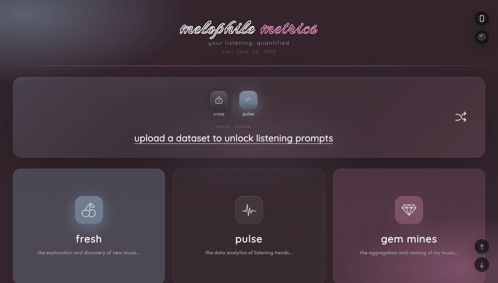
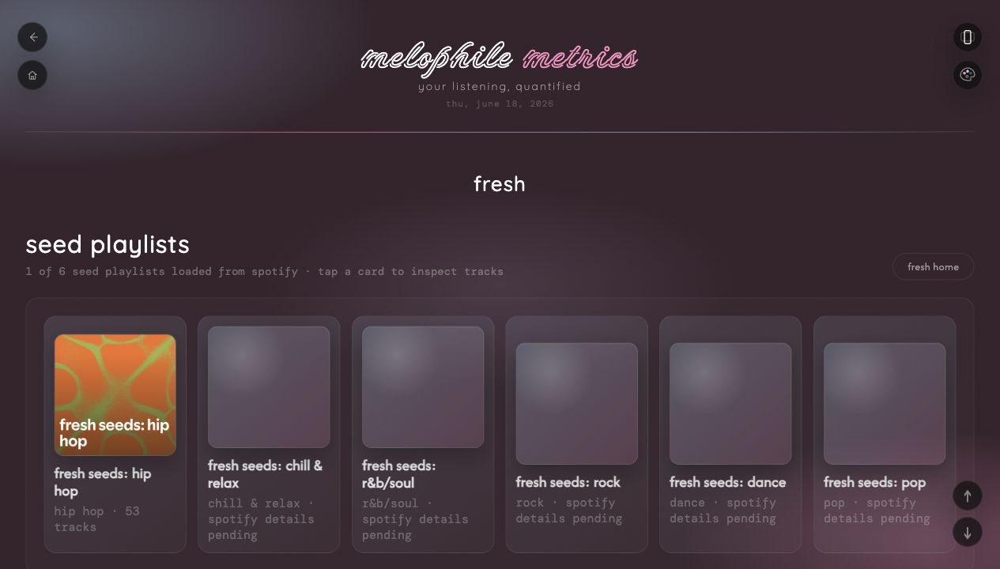
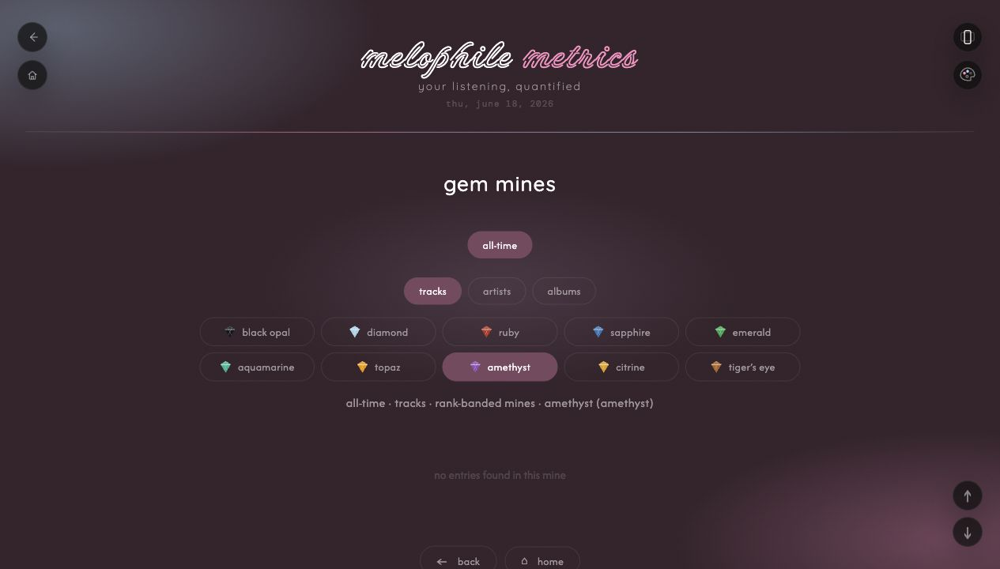
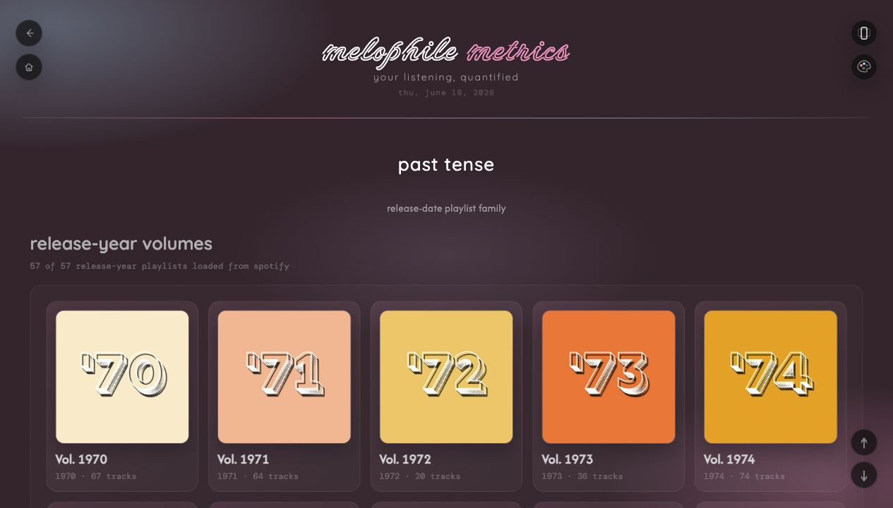

# Melophile Metrics

**Melophile Metrics is an AI-assisted personal music analytics application that turns Last.fm and Spotify listening activity into ranked insights, discovery workflows, and visual listening history.**

## Portfolio Status Notice

Melophile Metrics is a local-first personal analytics portfolio project that continues to evolve through active development. The public repository presents the product concept, development workflow, privacy approach, and representative screenshots reviewed for public presentation while excluding local credentials, private configuration, and personal data exports.

## Project Overview

Melophile Metrics explores how personal listening data can become a richer analytics system. The app combines Last.fm scrobble history, Spotify playlist data, and user-defined classification rules to answer questions such as:

- What music has shaped my listening history most strongly?
- Which songs, artists, and albums are rising in recent periods?
- Which older favorites have been forgotten?
- Which new releases are worth exploring?
- How can personal taste be organized into meaningful playlist systems?

The project is intentionally personal, but the underlying work demonstrates transferable skills in data analysis, product thinking, information architecture, data quality, and iterative software development.

## Why I Built It

I built Melophile Metrics because standard music apps show listening history, but rarely explain it in a way that supports reflection, curation, or decision-making. I wanted a system that could combine listening counts, playlist structure, release years, discovery workflows, and custom ranking rules into one coherent analytics experience.

## Problems It Solves

- Converts raw listening history into browsable ranking systems.
- Helps distinguish short-term listening spikes from long-term favorites.
- Creates workflows for rediscovering forgotten music.
- Tracks new releases from artists already connected to my taste profile.
- Supports playlist families such as release-year playlists, fresh discovery playlists, and ranked gem tiers.
- Provides data-integrity checks so Last.fm profile totals and local app totals can be reconciled.

## Screenshots

The screenshots below are included for portfolio review and avoid credential or account-settings screens.

### Main Navigation



The app opens into a nine-section card-based navigation system that organizes listening analysis, discovery, release-year playlists, rediscovery, settings, and future experience areas.

### Fresh Discovery



Fresh supports new-music discovery through seed playlists, harvest playlists, and release-monitoring workflows tied to Spotify playlist data and Last.fm listening history.

### Gem Mines



Gem Mines classifies tracks, artists, and albums into custom rank-banded tiers, making long-term favorites easier to browse and compare.

### Past Tense



Past Tense organizes release-year playlist families so each year can be explored as its own curated music-history view.

## Key Features

- **Fresh**: new-music discovery workflows built around seed playlists, harvest playlists, and monitored releases from artists connected to the listening record.
- **Pulse**: rolling rankings for recent listening windows such as the last 1, 3, 6, or 12 months.
- **Gem Mines**: custom rank-banded classifications that group tracks, artists, and albums into gem tiers.
- **Past Tense**: release-year playlist portals that organize favorite music by the year it was released.
- **Dashboard**: visual summaries of listening patterns, averages, yearly views, and data health.
- **Ghosted**: rediscovery workflows for artists and music that have faded from recent listening.
- **Apotheosis**: artist-expansion analysis that highlights artists whose catalog has not recently grown in the listening record.
- **Settings and Sync**: local configuration for Last.fm, Spotify, ListenBrainz, and MusicBrainz integrations.

## Analytical Methods And Concepts Demonstrated

- Data cleaning and local cache management.
- Time-window analysis across dynamic and static periods.
- Ranking, thresholding, and classification systems.
- Percentile-inspired segmentation and custom tiering.
- Playlist-family mapping and taxonomy design.
- Recency, frequency, and first-seen/last-seen analysis.
- Data-integrity comparison between local cached data and Last.fm profile totals.
- Human-centered workflow design for discovery, curation, and review.

## Technologies And Tools

- HTML, CSS, and vanilla JavaScript.
- Last.fm API for listening-history sync and profile comparison.
- Spotify Web API for playlist inventory, playlist contents, and music links.
- ListenBrainz and MusicBrainz as planned/open metadata enrichment layers.
- Browser localStorage for local settings and cached data.
- Git and GitHub for version control.
- AI coding tools used during iterative development.

## My Role And Contributions

Melophile Metrics is an AI-assisted application that I conceived, specified, tested, refined, and developed through an iterative collaboration with coding tools.

My contributions include:

- Defining the product vision and feature philosophy.
- Creating the analytical questions the app is meant to answer.
- Designing classification rules, gem tiers, playlist families, and thresholds.
- Planning workflows for discovery, rediscovery, and data review.
- Evaluating generated code and identifying bugs.
- Testing app behavior across local browser sessions.
- Refining the visual direction, layout, and user experience.
- Deciding how Last.fm, Spotify, and other music metadata sources should support the app.

## AI-Assisted Development Disclosure

This project was built with significant AI-assisted coding support. I did not independently hand-code every line. My role was to direct the product, define the analytical logic, test and critique the implementation, make design decisions, and guide the development process through iterative prompts, reviews, and refinements.

## How To Run The Application Locally

From the repository folder:

```sh
python3 -m http.server 8767
```

Then open:

```text
http://127.0.0.1:8767/melophile_metrics_v2.html
```

The app can be opened directly as a local HTML file for some views, but API authentication flows such as Spotify work best through the localhost URL above.

Optional local configuration can be based on:

```text
melophile_config.example.json
```

Create a private local copy named `melophile_config.local.json` when needed. That local file is ignored by Git.

## Experimental Electron Shell

The project now includes a minimal Electron shell that loads the existing single-file app without changing the renderer architecture:

```sh
npm install
npm start
```

This is the first step toward a local desktop architecture with private database-backed storage and API sync handled outside the renderer. The static browser workflow above remains supported.

## Current Development Status

Melophile Metrics is functional as a local portfolio application and continues to evolve through iterative development. The application depends on user-provided data and/or API access, so some views require Last.fm credentials, Spotify authorization, or locally cached data to display meaningful results.

## Planned Improvements

- Continue refining the nine-section card-based navigation system.
- Add stronger metadata enrichment through ListenBrainz and MusicBrainz.
- Improve correction workflows for Spotify links and metadata mismatches.
- Expand playlist-family tagging and cached playlist analysis.
- Add more privacy-safe portfolio screenshots and visual demos.
- Continue improving data-integrity checks between Last.fm and local cache.
- Explore animation and transition polish once core workflows stabilize.

## Skills Demonstrated

- Product thinking and feature planning.
- Data analysis and classification design.
- User-centered workflow design.
- Information architecture.
- Data visualization planning.
- API integration planning and implementation.
- QA testing and bug reporting.
- Version control and repository hygiene.
- AI-assisted software development and evaluation.

## About the Creator

Melophile Metrics was created by **Daniel Aberle** as a portfolio case study in personal analytics, information systems, data quality, workflow improvement, and AI-assisted application development. The project reflects Daniel's professional interest in turning messy personal data into structured, useful, and thoughtfully designed decision-support tools.

## Affiliation And Trademark Disclaimer

Melophile Metrics is an independent personal portfolio project. It is not affiliated with, endorsed by, or sponsored by Last.fm, Spotify, ListenBrainz, or MusicBrainz. Product names, trademarks, and service names belong to their respective owners.
